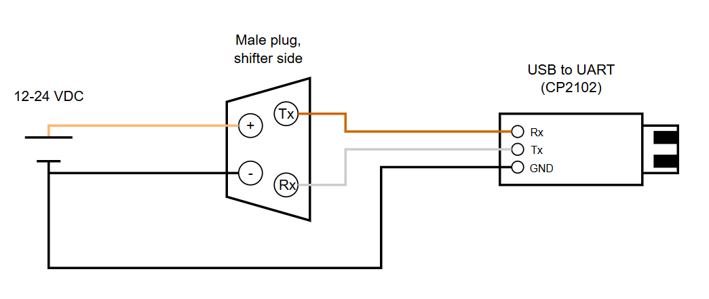
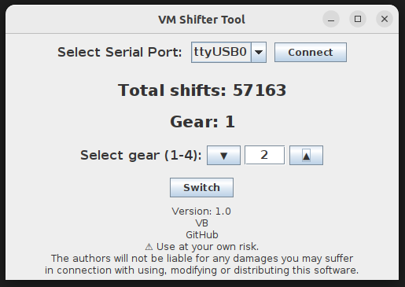
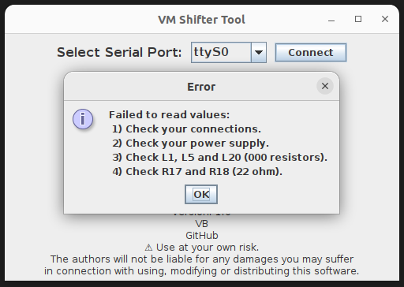
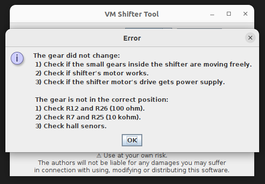

# A Java application that helps you communicate with the VM shifter and troubleshoot issues

This shifter tool is a simple Java-based GUI application that communicates with a VM shifter using Modbus RTU protocol over a serial connection, which allows users to monitor and switch gears in real time.


## Features

- Scans for available serial ports and allows the user to select the correct one.
- Shows the current gear and total shifts.
- Allows the user to manually change the gear.
- Displays troubleshooting information based on the most known/common issues (shout out to [r/VanMoofSelfRepair](https://www.reddit.com/r/VanMoofSelfRepair/) community 🤜🤛). 


## Requirements
Hardware:
- USB to UART Bridge (CP2102)
- Jumper wires
- 12 or 24VDC power supply 
- A female plug Higo Mini-B4-F 4S cable (23456) (To expose/break-out the shifte's plug pins)
- A Breadboard (Optional) 


Software:
- Java Runtime Environment (JRE)

## Installation

1. **Java Runtime Environment**

If you don't have JRE installed already, download and install it from the official [website](https://jdk.java.net/24/).<br>You might need to check a tutorial on how to properly install it.


2. **Download jar file**

    To use the tool, download the shifter-tool-1.0-SNAPSHOT.jar from the [target](target) directory.
- Click on the jar file, then click download the raw file
- Open a terminal window and enter the directory, for example on Windows:
    ```sh
    cd C:\Users\YourUser\Downloads
    #Assuming you extracted the file in the Downloads directory


## Usage

1. **Connect the shifter to your PC and to the power supply according to the diagram (start from the shifter side):** 

***⚠  Be carefull with the wiring. Wrong connection can damage the e-shifter, the UART adapter or even your PC! ⚠***

Turn on the power supply when everything is connected.




2. **Run the application:**
    ```sh
    java -jar shifter-tool-1.0-SNAPSHOT.jar


3. **Application GUI:**


- The application will list all available serial ports in a drop down list.
- Sellect the port on which your shifter is connected and click "Connect".
- If the connection is succesful the number of total shifts and the current gear possition will be updated, if not follow the instructions on the pop up window with the most common issues to troubleshoot.
- You can change the gear by selecting the number from the up and down arrows and pressing the "Switch" button. If the gear doesn't change follow the instructions on the pop up window with the most common issues to troubleshoot.


## Error examples





## Contributing & Future Plans
Contributions to make this tool better are more than welcome!<br>Please submit a Pull Request or open an Issue if you have suggestions for improvements, bug reports etc.<br>Feel free to give a star ⭐ (top right) if you like the project.


## Acknowledgments
- [jSerialComm](https://fazecast.github.io/jSerialComm/)
- [modbus4j](https://github.com/MangoAutomation/modbus4j)
- Many thanks to Daniel from [Danmoof](https://www.instagram.com/danmoof) for donating a cable harness that I use for tapping the communication wires


## Disclaimer
This software is provided "as is". The authors make no representations or warranties of any kind concerning the safety, suitability, inaccuracies or other harmful components of this software. The authors will not be liable for any damages you may suffer in connection with using, modifying or distributing this software.

**Use this software at your own risk.** This project is intended for research purposes only. 

**Please note that everything has been built based on my own research. No information has been provided by VM.**